#  Fuzzy clustering of given data

## Authors

1. Piotr Solarz
2. Wojciech Weber
3. Szymon Zosgórnik

## Task description

* Find clusters on the basis of training data of the database. Use crisp and fuzzy clustering.
Change parameters of fuzzy and crisp clustering. In this way try to find the optimal solution with the lowest error for test data. In case of number of clusters greater than original diagnoses define your own diagnosis in test data - pretend that you are researchers defining sub-group of the disease. Is it beneficial?
* Make research documentation at every stage. Make plots of clusters projected on 2-dimensional surface. Using Principal Component Analysis will be the most appreciated.

## Dataset description

### Context

This dataset is originally from the National Institute of Diabetes and Digestive and Kidney Diseases. The objective of the dataset is to diagnostically predict whether or not a patient has diabetes, based on certain diagnostic measurements included in the dataset. Several constraints were placed on the selection of these instances from a larger database. In particular, all patients here are females at least 21 years old of Pima Indian heritage.

### Content

The datasets consists of several medical predictor variables and one target variable - outcome. Predictor variables includes the number of pregnancies the patient has had, plasma glucose concentration 2 hours in an oral glucose tolerance test, diastolic blood pressure (mm Hg), triceps skin fold thickness (mm), 2-hour serum insulin (mu U/ml), BMI (Body mass index), diabetes pedigree function and an age.

Number of specific values:

* Predictor variables: 8, 7 are compatible (since clustering methods are desired ones, outcome is not used).
* Original classes: 2.
* Training examples: 200.
* Testing examples: 332.

## Clustering methods

Two clustering algorithms were compared: crisp and fuzzy. Following implementations were chosen: KMeans from sklearn.cluster and cmeans, cmeans_predict from skfuzzy.cluster. Description of these algorithms is shown bellow.

* Crisp clustering - each data point is assigned to its nearest cluster center (hard membership).
* Fuzzy clustering - the memberships of clusters are soft. Every data point belongs at some degree to each cluster center. The membership is usually related to the distance between the data point and the cluster center.


## Results

The threshold for visualizing fuzzy clustering was set to default 0.5. Error was calculated only for 2 clusters due to compatibility connected with original data.

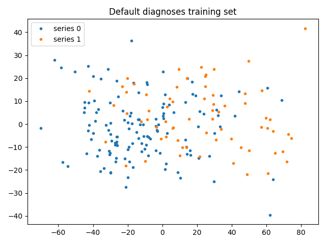

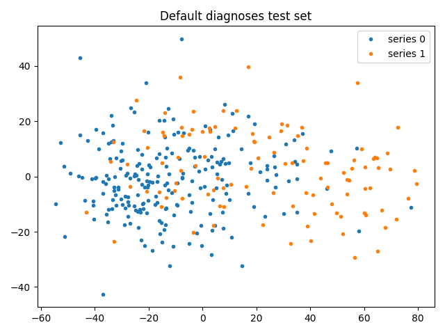

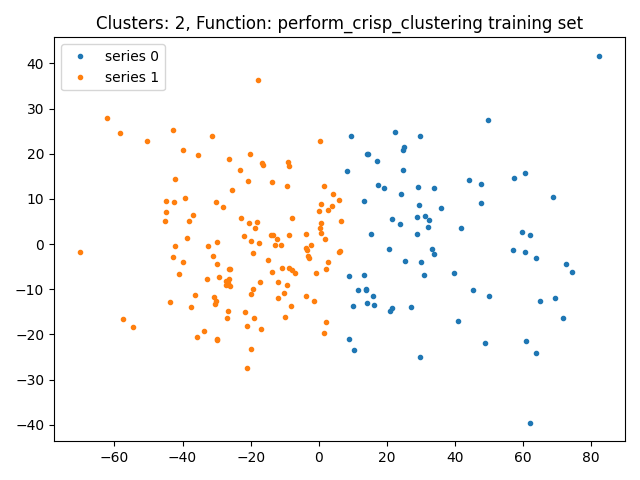
Error = 25%

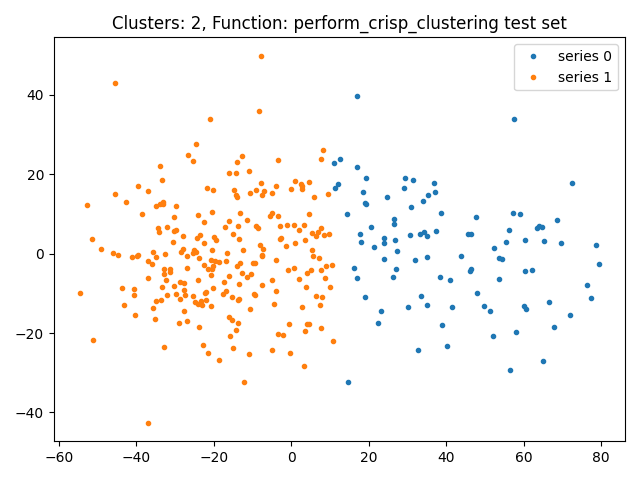
Error = 22.6%

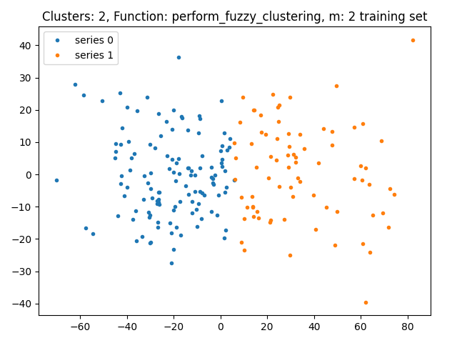
Error = 25%

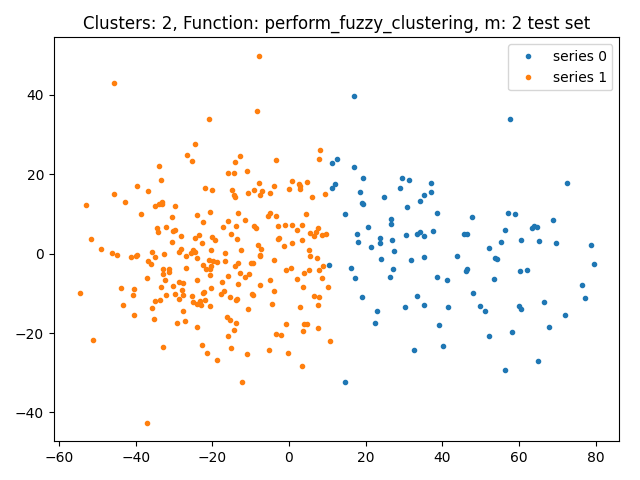
Error = 24.1%

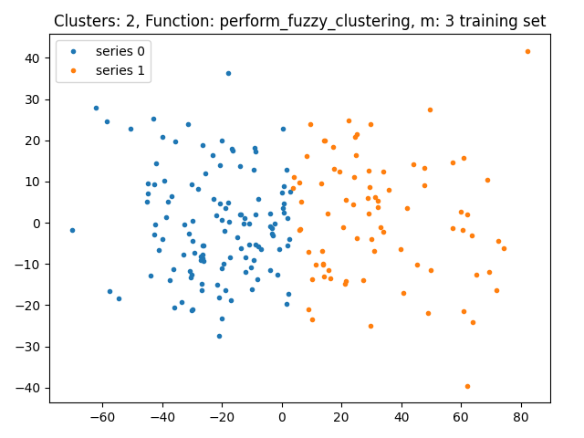
Error = 24.5%

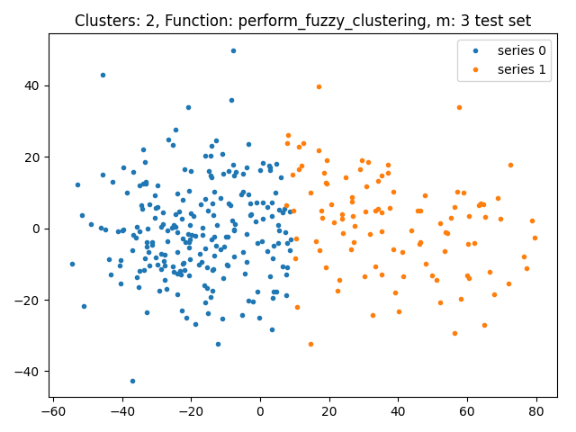
Error = 25%


Error = 26%

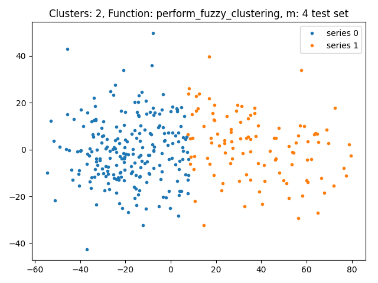
Error = 22.9%

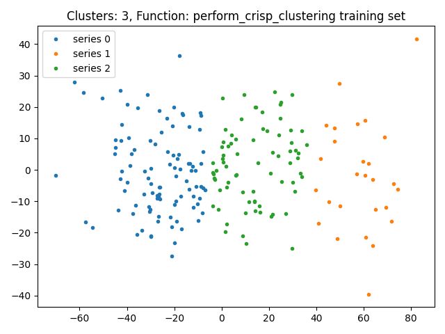
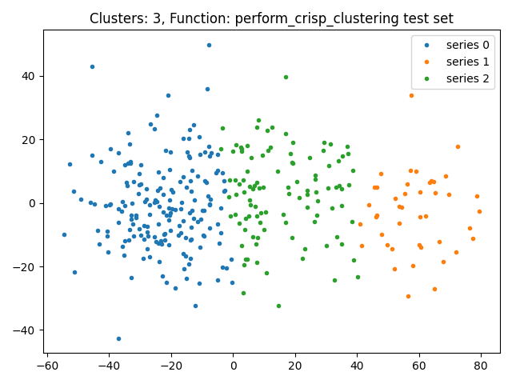
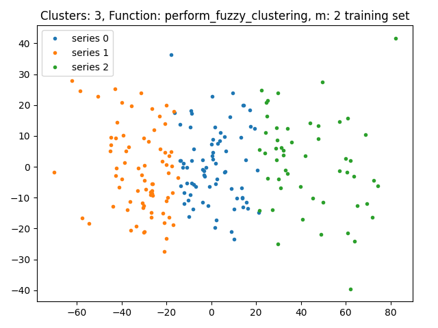
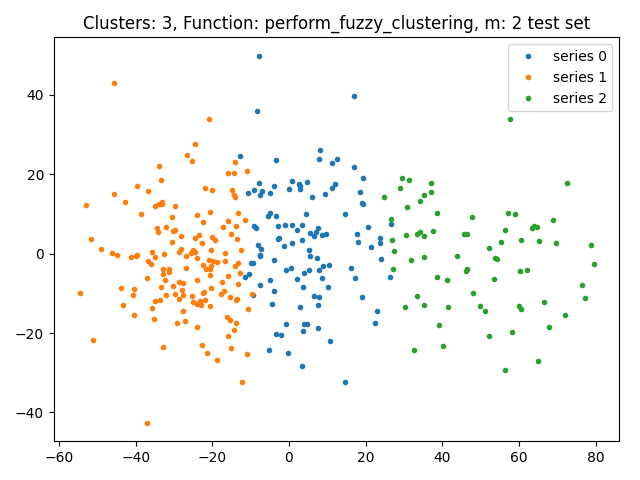
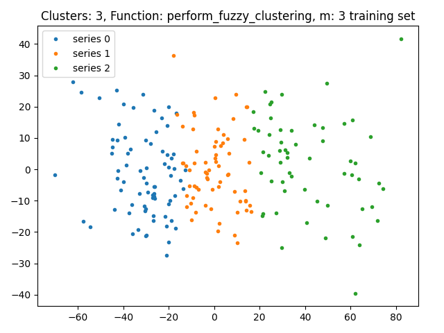
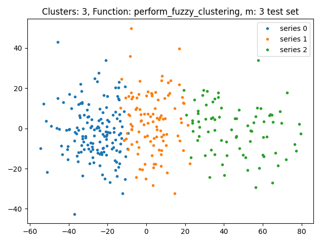
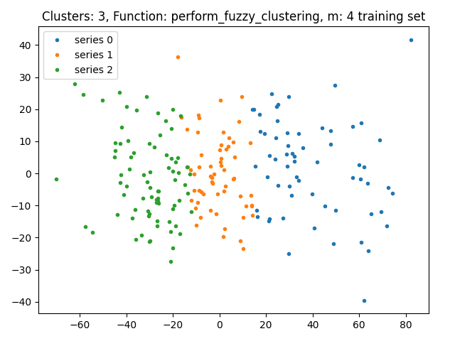
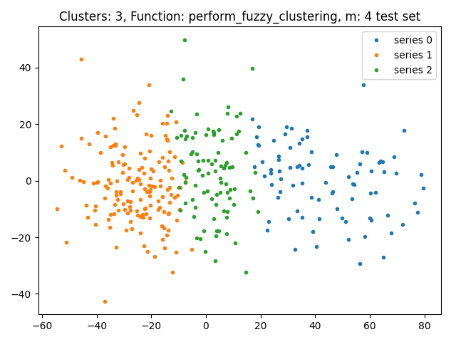

## Results for non-standard threshold

The threshold for visualizing fuzzy clustering was changed from 0.5 to 0.2.

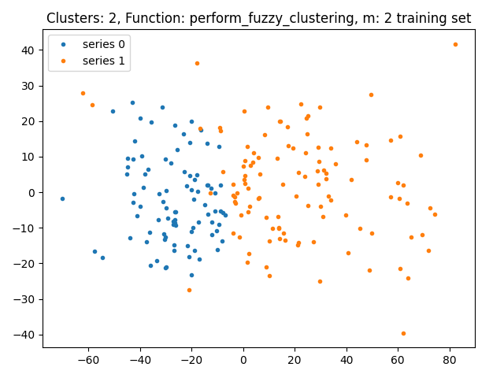

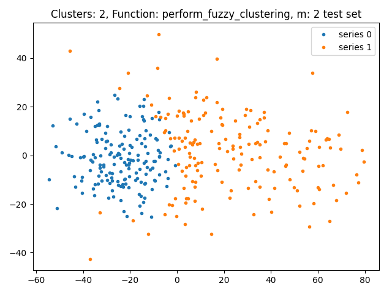


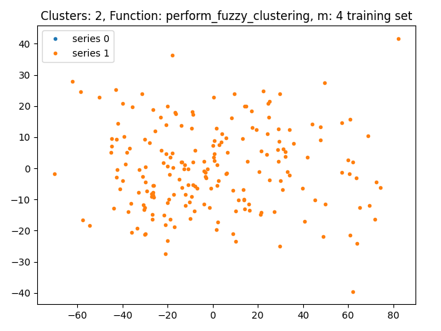
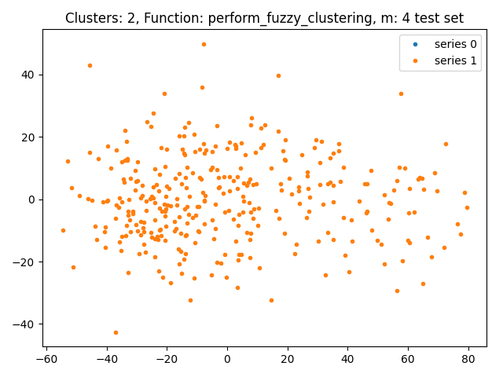
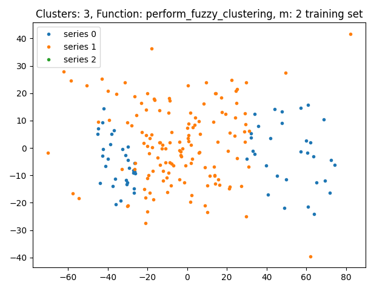
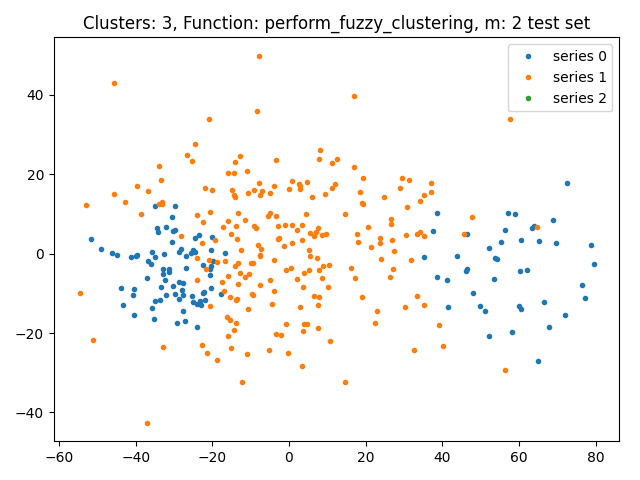
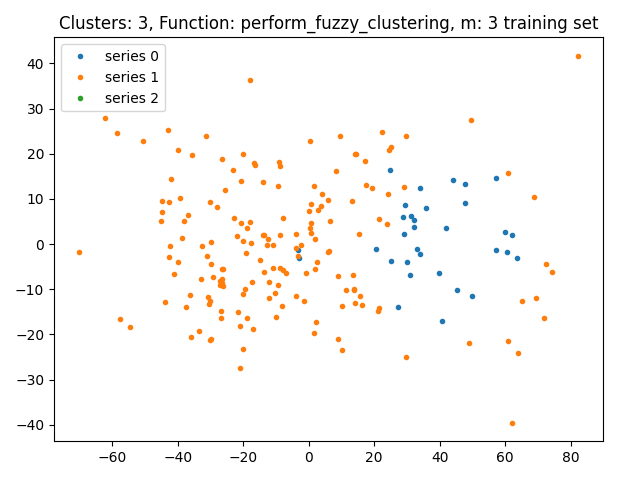
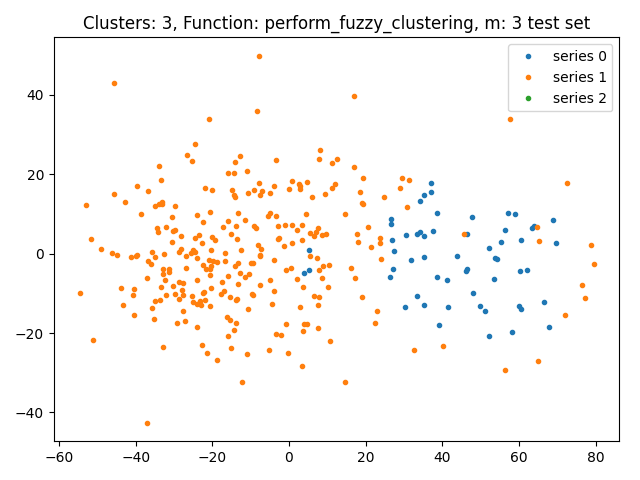
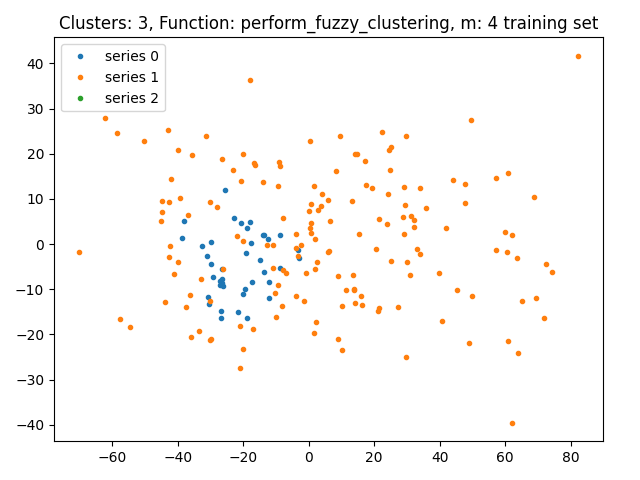
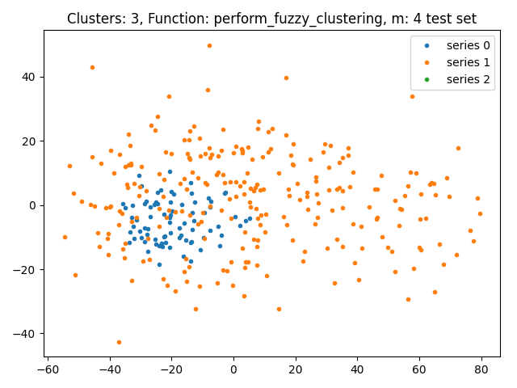

## Summary and conclusions

* Crisp clustering (k-means algorithm) and fuzzy clustering (c-means algorithm) were performed.
* The m parameter in fuzzy clustering was one of values from set {2, 3, 4}. In case of standard displaying (with 0.5 threshold) no significant difference was observed. However with usage of 0.2 threshold larger m resulted in very unpleasant clustering.  
* Obtained solutions for crisp and fuzzy clustering are very similar. The error is always around 25%.
* The third cluster could represent intermediate step between being ill and healthy.
* Usage of unsupervised learning is not the best approach in this particular task - datasets are not divided into easy to distinguish clusters.
* One of classification methods (supervised learning) ought to be used in this scenario. It would benefit from output value of given data.

## Source code

```python
import re
import numpy as np
import pandas as pd
import matplotlib.pyplot as plt
from functools import partial
from contextlib import ExitStack
from sklearn.cluster import KMeans
from sklearn.decomposition import PCA
from skfuzzy.cluster import cmeans, cmeans_predict


raw_datasets = ["models/" + name for name in ["pima.tr", "pima.te"]]
datasets = ["models/" + name for name in ["training.csv", "test.csv"]]


def preprocess_datasets() -> None:
    with ExitStack() as stack:
        raws = [stack.enter_context(open(file, 'r')) for file in raw_datasets]
        processed = [stack.enter_context(open(file, 'w')) for file in datasets]
        for raw, proc in zip(raws, processed):
            dataset = raw.readlines()
            dataset = [re.sub(r"^ +", "", row) for row in dataset]
            dataset = [re.sub(r" +", ",", row) for row in dataset]
            proc.writelines(dataset)


def import_datasets() -> tuple:
    cols = pd.read_csv(datasets[0], nrows=1).columns
    return tuple(pd.read_csv(file, usecols=cols[:-1]) for file in datasets)


def read_diagnoses() -> tuple:
    cols = pd.read_csv(datasets[0], nrows=1).columns
    diagnoses = tuple()
    for dataset in datasets:
        read = pd.read_csv(dataset, usecols=cols[-1:])
        diagnoses += (np.array([*map(lambda x: 1 if x == "Yes" else 0,
                                     read.values)]),)
    return diagnoses


def perform_crisp_clustering(training: np.array, test: np.array,
                             clusters: int) -> tuple:
    kmeans = KMeans(clusters)
    kmeans.fit(training)
    return kmeans.labels_, kmeans.predict(test)


def perform_fuzzy_clustering(training: np.array, test: np.array,
                             clusters: int, m: int) -> tuple:
    center, train_labels = cmeans(training.T, clusters, m, 0.005, 1000)[0:2]
    test_labels = cmeans_predict(test.T, center, m, 0.005, 1000)[0]
    return *(np.argmax(label, 0) for label in [train_labels, test_labels]),


def perform_pca(training: np.array, test: np.array) -> list:
    pca = PCA(2)
    pca_datasets = [training, test]
    for pos, dataset in enumerate(pca_datasets):
        pca.fit(dataset)
        pca_datasets[pos] = pca.transform(dataset)
    return pca_datasets


def plot_datasets(pca_datasets: list, diagnoses: tuple,
                  clusters: int, title: str) -> None:
    for idx, (dataset, diagnose) in enumerate(zip(pca_datasets, diagnoses)):
        for j in range(clusters):
            plt.plot(dataset[diagnose == j, 0],
                     dataset[diagnose == j, 1], 'o', markersize=3,
                     label='series ' + str(j))
        plt.title(title + (" training set" if not idx else " test set"))
        plt.legend()
        plt.show()


def test_algorithms(training: np.array, test: np.array, pca_datasets: list,
                    clusters: int, diagnoses: tuple) -> None:
    algorithms = [partial(perform_fuzzy_clustering, training,
                          test, clusters, m) for m in range(2, 5)]
    algorithms += [partial(perform_crisp_clustering, training, test, clusters)]
    for algorithm in algorithms:
        result = algorithm()
        print([sum(res) for res in [x == y for x, y in
                                    zip(result, diagnoses)]])
        title = "Clusters: {}, Function: {}".format(clusters,
                                                    algorithm.func.__name__)
        if "fuzzy" in algorithm.func.__name__:
            title += ", m: {}".format(algorithm.args[-1])
        plot_datasets(pca_datasets, result, clusters, title)


def main():
    preprocess_datasets()
    training_set, test_set = import_datasets()
    training, test = training_set.values, test_set.values
    diagnoses = read_diagnoses()
    pca_datasets = perform_pca(training, test)
    plot_datasets(pca_datasets, diagnoses, 2, "Default diagnoses")
    for clusters in range(2, 4):
        test_algorithms(training, test, pca_datasets, clusters, diagnoses)


if __name__ == "__main__":
    main()

```
